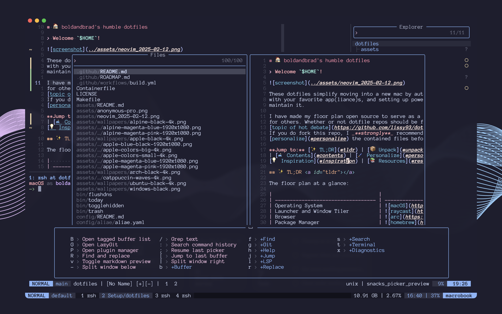

# 🏠 boldandbrad's humble dotfiles



## 🗝️ Welcome `$HOME`

These dotfiles simplify moving into a new mac by automatically furnishing it
with your favorite app(liance)s, and setting up power(ful) tools so you can
maintain it.

> [!WARNING]
> I have made my macOS floor plan open source to serve as a blueprint and
> inspiration for others. However, these dotfiles are both highly customized and
> [volatile](https://github.com/boldandbrad/dotfiles/commits/main/). Feel free
> to explore the [contents](#contents) and use what you like, but
> [I do not recommend forking](https://github.com/lissy93/dotfiles?tab=readme-ov-file#so-copy-paste-right).

**Jump to:** [✨ TL;DR](#tldr) | [📦 Unpack](#unpack) | [🛋️ Contents](#contents)
| [🛠️ Maintain](#maintain) | [💡 Inspiration](#inspiration) |
[📚 Resources](#resources)

## ✨ TL;DR <a id="tldr"></a>

The floor plan at a glance:

|                                    |                                                                                                                                                                                                                                                                                                                                                                 |
| ---------------------------------- | --------------------------------------------------------------------------------------------------------------------------------------------------------------------------------------------------------------------------------------------------------------------------------------------------------------------------------------------------------------- |
| Operating System                   |                                                                                                                                                                                                                                                                        |
| Launcher and Window Tiler          | *                                                                                                                                                                                                                                                                |
| Browser                            |                                                                                                                                                                  |
| Package Manager                    |                                                                                                                                                                                                                                                               |
| Env, Alias, PATH & Dotfile Manager |                                                                                                                                                                                                                                                                                 |
| Terminal Emulator                  |                                                                                                                                                                                                                                                              |
| Terminal Multiplexer               |                                                                                                                                                                                                                                                                           |
| Shell                              |                                                                                                                                                                                                                                                                              |
| Shell Prompt                       |                                                                                                                                                                                                                                                                                                    |
| Editor                             |                                                                                                                                                                   |
| Version Control                    |                                                                                                                                                                                                                            |
| Typeface                           |                                                                                                                                                                                                                                                                                         |
| Theme / Colorsheme                 |                                                                                                                                                                                                                                    |
| Programming Langauges              |     |
|                                    |                                                                                                                                                                                                                                                                                                                                                                 |

\* manual configuration

## 📦 Unpack <a id="unpack"></a>

Setup and installation is handled by [`unpack.sh`](../unpack.sh). The unpack
script explains what it will do, prompts before doing so, and is idempotent.
This means it can be safely run multiple times to keep the system in sync
without compounding changes or breaking.

In brief, unpacking does the following:

- ✅ Verify system compatibility
- 🔄 Check and prompt for system updates
- ⬇️ Install or update user packages and apps
- 🔗 Symlink user dotfiles and configs
- ⚙️ Apply user system settings
- 🌱 Clone user github repos

> [!WARNING]
> Before unpacking, review the repo [contents](#contents) and backup any
> pre-existing configs.

### Get it Delivered

```sh
/bin/bash -c "$(curl -fsSL https://raw.githubusercontent.com/boldandbrad/dotfiles/main/ship.sh)"
```

This will download and run [`ship.sh`](../ship.sh), which clones this repo to
`~/Setup/dotfiles` (if not present) and then prompts you to run
[`unpack.sh`](../unpack.sh).

### Haul it Yourself

Alternatively you can clone the repo and run [`unpack.sh`](../unpack.sh)
manually.

```sh
git clone --recursive https://github.com/boldandbrad/dotfiles.git ~/Setup/dotfiles
cd ~/Setup/dotfiles && ./unpack.sh
```

Continue reading for more details on what to expect.

## 🛋️ Contents <a id="contents"></a>

The contents of this repo are organized into a few high level directories.

```txt
dotfiles/
├── bin/            # Custom executables and scripts. Appended to PATH by aliae.
│  └── ..
├── config/         # Config files for packages and apps. Symlinked by aliae.
│  └── ..
├── util/           # Shell scripts and utilities for system and tool setup. Sourced by unpack.sh.
│  └── ..
├── vendor/         # Dependencies which are managed as git submodules.
│  └── ..
├── ..
├── Makefile        # Helpful development commands.
├── ship.sh         # Remote installation script.
└── unpack.sh       # Main installation and setup script.
```

### Configs

The [`config/`](../config/README.md) directory contains config files for
packages and apps. They are symlinked to their respective locations on the
system by `aliae` as specified in [`aliae.yaml`](../config/aliae/aliae.yaml).

Most packages and apps respect the
[XDG base directory specification](https://specifications.freedesktop.org/basedir-spec/latest/index.html)
to determine where to store configurations and data. This creates consistency
and predictability while keeping your `$HOME` free of clutter.

The following XDG variables are defined in
[`aliae.yaml`](../config/aliae/aliae.yaml), and are sourced before symlinking.

| Env Variable      | Location             |
| ----------------- | -------------------- |
| `XDG_BIN_HOME`    | `~/.local/bin`       |
| `XDG_CACHE_HOME`  | `~/.local/var/cache` |
| `XDG_CONFIG_HOME` | `~/.config`          |
| `XDG_DATA_HOME`   | `~/.local/share`     |
| `XDG_LIB_HOME`    | `~/.local/lib`       |
| `XDG_STATE_HOME`  | `~/.local/state`     |

### Util

The `util/` directory contains shell scripts and utilities that automate system
and tool setup. This includes OS specific scripts for installing apps and
dependencies, and system configurations. Most of these scripts are sourced
directly from `unpack.sh` at the repo root.

> Docs coming soon.

## 🛠️ Maintain <a id="maintain"></a>

To make system maintanence simpler after unpacking, a handful of convenient
[aliases](../config/aliae/aliae.yaml) are provided. Invoke these from anywhere.

| Command       | Description                                                 |
| ------------- | ----------------------------------------------------------- |
| `sys-refresh` | Rerun system setup ([`unpack.sh`](../unpack.sh))            |
| `sys-clean`   | Clean system caches and app data (❌ Coming soon)           |
| `dot-commit`  | Persist current dotfiles to github (❌ Coming soon)         |
| `dot-relink`  | Relink installed dotfiles                                   |
| `zsh-reload`  | Reload shell environment ([`.zshrc`](../config/zsh/.zshrc)) |
| `dep-check`   | Check if all apps and dependencies are installed            |
| `dep-refresh` | Install/update all apps and dependencies                    |
| `dep-prune`   | Uninstall apps and dependencies that aren't needed          |
| `git-reclone` | Reclone user github repos                                   |

## 💡 Inspiration <a id="inspiration"></a>

There are tons of great dotfile and machine setup repos out there. In
particular, I took inspiration from these gems:

- [dreamsofcode-io/dotfiles](https://github.com/dreamsofcode-io/dotfiles) - nvim
  and tmux configs
- [lissy93/dotfiles](https://github.com/lissy93/dotfiles) - install scripts and
  repo structure
- [stefanzweifel/dotfiles](https://github.com/stefanzweifel/dotfiles)
- [superatomic/dotfiles](https://github.com/superatomic/dotfiles)
- [webpro/dotfiles](https://github.com/webpro/dotfiles)

## 📚 Resources <a id="resources"></a>

- [Roadmap](ROADMAP.md) - planned changes and updates to this repo
- [boldandbrad docs 🔗](https://boldandbrad.github.io/docs) - my personal dev
  docs
- [Dotfiles Community 🔗](https://dotfiles.github.io/) - a great collection of
  dotfile resources
- [dotfyle 🔗](https://dotfyle.com/) - discover neovim plugins and
  configurations, including [mine](https://dotfyle.com/boldandbrad/)

## ⚖️ License <a id="license"></a>

Copyright (c) 2021-present Bradley Wojcik. Released under the MIT License. See
[LICENSE](../LICENSE) for details.
